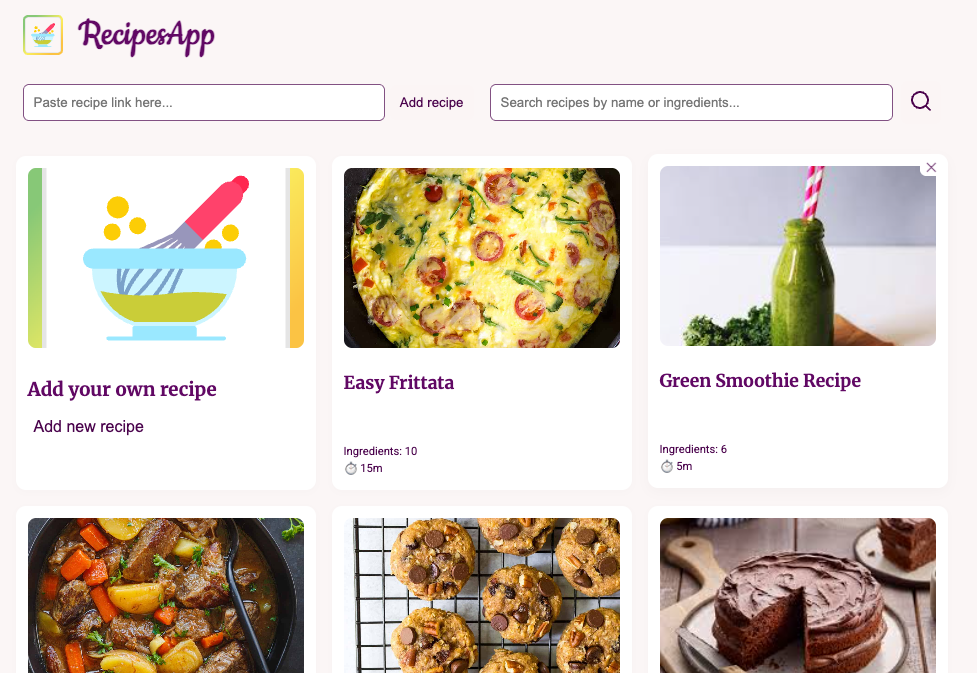
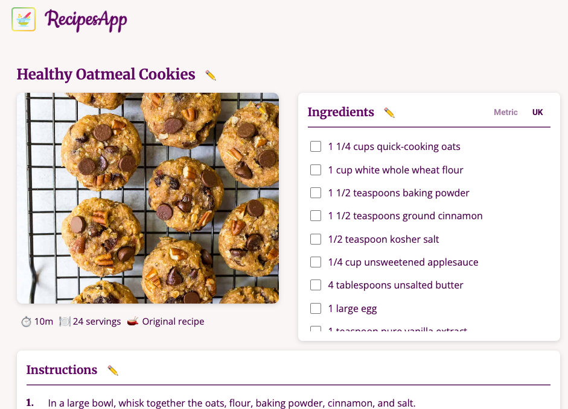
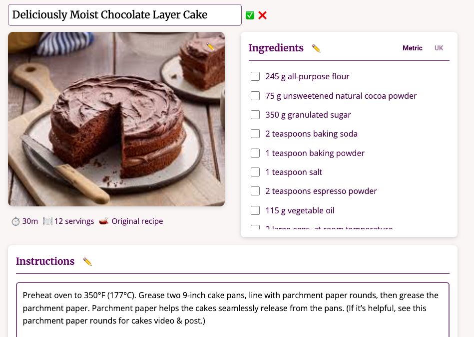
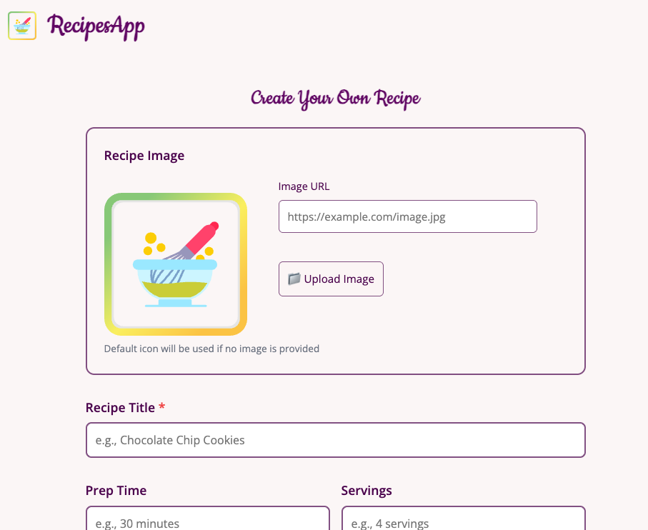

# RecipesApp

A modern, handy, feature-rich recipe management application that helps you organise, customise, store, collect and convert your favorite recipes.

## 📑 Table of Contents

-   [Quick Start](#-quick-start)
-   [Features](#-features)
-   [Tech Stack](#-tech-stack)
-   [Installation](#-installation)
-   [Roadmap](#-roadmap)
-   [Contributing](#-contributing)
-   [License](#-license)

## 🖼️ Screenshots






## ⚡ Quick Start

```bash
# Clone repo
git clone https://github.com/yourusername/recipes-app.git
cd recipes-app

# Start frontend
npm install
npm run dev

# Start backend
cd backend
pip install -r requirements.txt
flask db upgrade
python3 app.py
```

## ✨ Features

### 📥 Recipe Import

-   **Add by URL** – Automatically scrape recipes from popular cooking websites
-   **Manual entry** – Create your own recipes from scratch with a user-friendly form
-   **Smart parsing** – Automatically extracts ingredients, instructions, prep time, and servings

### 🔍 Recipe Management

-   **Search** Quickly find recipes by name or ingredients with smart scoring
-   **Card grid display**: Browse recipes in a clean, visual card layout
-   **Recipe Details** View comprehensive recipe information on dedicated pages
-   **Delete Recipes** Remove unwanted recipes with a single click

### ✏️ Editing Capabilities

-   **Editing** Edit title, ingredients, instructions, and notes
-   **Image upload** Add or update recipe images via URL or file upload
-   **Personal notes** Add your own tips, modifications, and comments to any recipe

### 📏 Measurement Conversion

UK/Imperial ↔ Metric: Toggle between measurement systems with one click
Smart Conversion: Automatically converts:

Cups, ounces, pounds → grams/milliliters
Tablespoons/teaspoons (for butter) → grams
Fahrenheit → Celsius
Handles fractions (1/2, 1 1/4, etc.)

### ✅ Interactive Ingredients

-   **Checkboxes** Mark ingredients as you add them while cooking
-   **Real-time conversion** See measurements in your preferred system instantly
-   **Line-by-line display** Clean, easy-to-read ingredient list

### 📋 Smart Instructions

-   **Auto-formatting** Automatically detects and numbers multiple steps
-   **Single step support** Displays single instructions without numbering
-   **Editable** Modify cooking instructions anytime

### 🎨 User Experience

-   **Responsive design** Works seamlessly on desktop, tablet, and mobile
-   **Clean interface** Modern, intuitive UI with smooth animations
-   **Component architecture** Built with reusable React components for maintainability

## 🚀 Tech Stack

### 🖥️ Frontend

⚛️ [React] — UI framework

🧭 [React Router] — Navigation

🎨 CSS3 — Styling with CSS variables for theming

⚡ [Vite] — Build tool and development server

### 🖲️ Backend

🐍 [Flask] — REST API

🐘 [PostgreSQL] — Database

🧾 [SQLAlchemy] — ORM

🍽️ [recipe-scrapers] — Web scraping library

## 📦 Installation

### Prerequisites

Node.js (v18+)
Python (v3.8+)
PostgreSQL

### Frontend Setup

Clone the repository

```bash
git clone https://github.com/yourusername/recipes-app.git
cd recipes-app </pre>
```

Install frontend dependencies

```bach
npm install
```

Start the development server

```bach
npm run dev
```

### Backend Setup

Navigate to the backend directory

```bach
cd backend
```

Install backend dependencies

```bach
pip install -r requirements.txt
```

### Set up database

### Create PostgreSQL database and update connection string in config

### Run migrations

```bach
flask db upgrade
```

### Start server

```bach
python3 app.py
```

## 🔜 Roadmap

<p>User authentication and personal accounts </p>
<p>Recipe categories and tags</p>
<p>Meal planning calendar</p>
<p>Shopping list generation</p>
<p>Recipe sharing and social features</p>
<p>Nutrition information</p>
<p>Recipe ratings and reviews</p>
<p>Russian/Ukrainian recipe parsing</p>
<p>Android/iOS mobile apps</p>
<p>Recipe collections and favorites</p>

## 🤝 Contributing

Contributions are welcome!

1. Fork the repo
2. Create a new branch
3. Commit your changes
4. Submit a Pull Request

## 📄 License

This project is licensed under the [MIT License](LICENSE).
